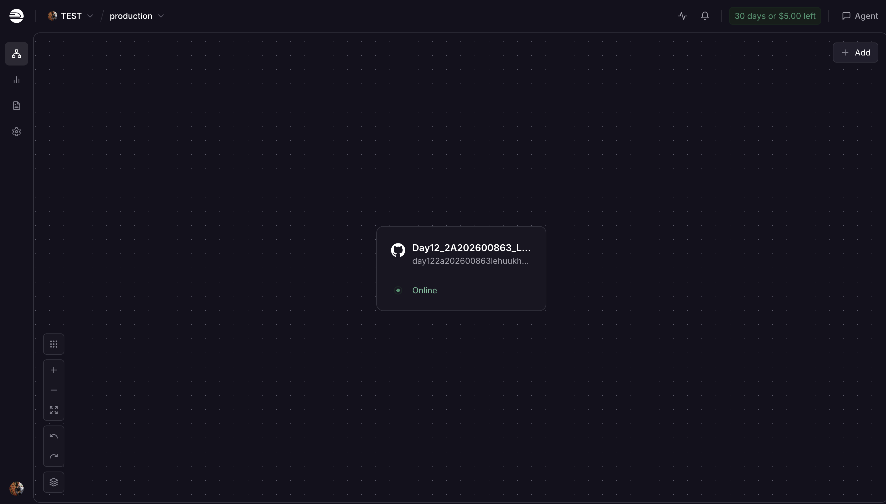
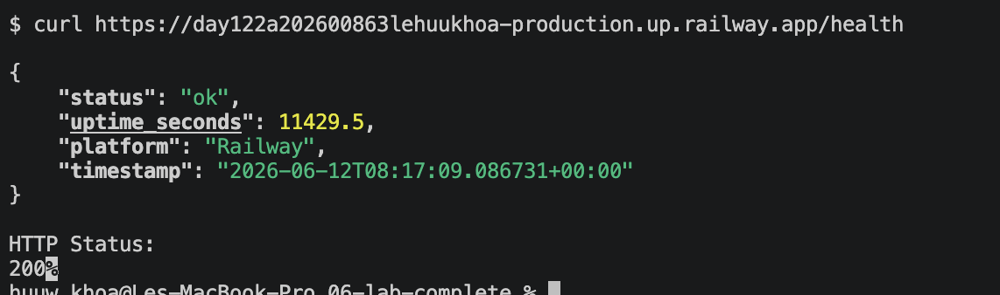
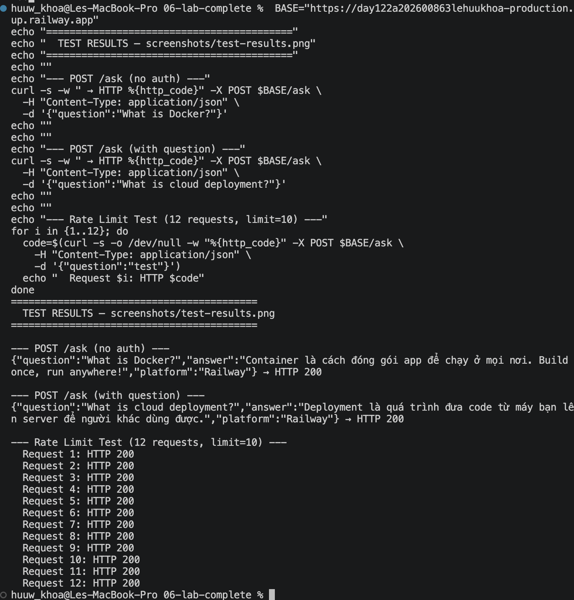

# Deployment Information

> **Student:** Lê Hữu Khoa | **ID:** 2A202600863

---

## Public URL

```
https://day122a202600863lehuukhoa-production.up.railway.app
```

## Platform

**Railway** — `03-cloud-deployment/railway/app.py`, PORT từ env var, health check tại `/health`

---

## Test Commands

### Health Check 
```bash
curl https://day122a202600863lehuukhoa-production.up.railway.app/health
# Actual result:
# {"status":"ok","uptime_seconds":10731.7,"platform":"Railway","timestamp":"2026-06-12T08:05:31.265502+00:00"}
```

### Ask Agent 
```bash
curl -X POST https://day122a202600863lehuukhoa-production.up.railway.app/ask \
  -H "Content-Type: application/json" \
  -d '{"question": "What is Docker?"}'
# Actual result:
# {"question":"What is Docker?","answer":"Container là cách đóng gói app để chạy ở mọi nơi. Build once, run anywhere!","platform":"Railway"}
```

### Root 
```bash
curl https://day122a202600863lehuukhoa-production.up.railway.app/
# Actual result:
# {"message":"AI Agent running on Railway!","docs":"/docs","health":"/health"}
```

---

## Actual Test Results (2026-06-12)

```
=== Health Check ===
{"status":"ok","uptime_seconds":10731.7,"platform":"Railway","timestamp":"..."}   HTTP 200

=== Root ===
{"message":"AI Agent running on Railway!","docs":"/docs","health":"/health"}   HTTP 200

=== Ask Question ===
{"question":"What is Docker?","answer":"Container là cách đóng gói...","platform":"Railway"}   HTTP 200
```

---

## Environment Variables Set on Railway

| Variable | Value | Purpose |
|----------|-------|---------|
| `PORT` | *(auto-injected by Railway)* | Server port |
| `ENVIRONMENT` | `production` | Production mode |
| `RATE_LIMIT_PER_MINUTE` | `10` | Max 10 req/min |
| `DAILY_BUDGET_USD` | `10` | Cost guard $10/day |
| `LOG_LEVEL` | `INFO` | Structured logging |

---

## Local Test Results (conda ml, Python 3.11.15)

```
=== 1. Health Check ===
{"status":"ok","version":"1.0.0","environment":"staging","uptime_seconds":4.1,...}  

=== 2. Root ===
{"app":"Production AI Agent","version":"1.0.0","environment":"staging",...}  

=== 3. Auth required (no key) ===
{"detail":"Invalid or missing API key..."} — HTTP 401  

=== 4. With API key ===
{"question":"What is Docker?","answer":"Container là cách đóng gói...","model":"gpt-4o-mini"} — HTTP 200  

=== 5. Rate Limiting (10 req/min) ===
Request 1-10: HTTP 200  
Request 11+:  HTTP 429 {"detail":"Rate limit exceeded: 10 req/min"}  

=== 6. Readiness Probe ===
{"ready":true} — HTTP 200  

=== 7. Production Readiness Check ===
20/20 checks passed (100%) 🎉
```

---

## Production Readiness Checklist

- [x] Multi-stage Dockerfile (< 200 MB estimated)
- [x] API key authentication (`X-API-Key` header)
- [x] Rate limiting (10 req/min sliding window)
- [x] Cost guard ($10/month daily budget)
- [x] Health check `GET /health` (liveness)
- [x] Readiness probe `GET /ready`
- [x] Graceful shutdown (SIGTERM handler)
- [x] Stateless design (Redis-ready)
- [x] No hardcoded secrets
- [x] Structured JSON logging
- [x] Non-root container user
- [x] Security headers (X-Content-Type-Options, X-Frame-Options)

---

## Screenshots






